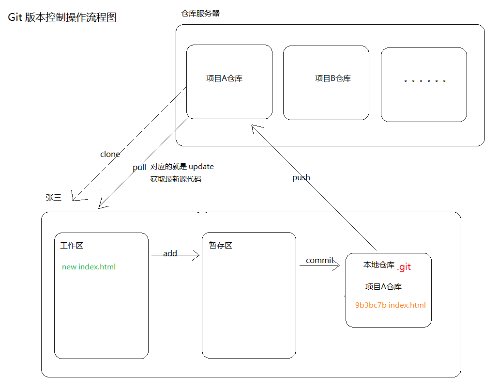

# 快速上手

## 安装与配置

### 下载安装

下载地址：https://git-for-windows.github.io/

### 初始设置

通过在命令台输入 `git --version` 查看是否有 Git 环境。

- `git config --global user.name "你的名字`
- `git config --global user.email "你的邮箱`
- `git config --global gui.encoding utf-8`
  + 这个配置项是解决在命令行中使用 gitk 的时候乱码的问题

上面的配置用来配置执行 commit 的时候，记录提交者的一些基本的信息（名字+邮箱）。
执行上面两条命令在任何目录都可以，而且只需要在第一次安装了 git 环境之后配置一下即可。

如果想要修改，可以使用上面命令重新执行即可修改，
也可以使用另外一种方式，执行上面命令之后会在用户目录下生成一个叫做 `.gitconfig` 的文件，
所以也可以通过修改该文件来修改git的配置。

---

## 原理模型



---

## 基本操作

以后所有的项目文件，都使用 utf8 编码，如果你的文件就是 gbk 编码文件，
你使用 git bash 提交的时候，应该是可以自动转码然后提交的。

建议：以后所有的文件都使用 utf8 编码。

```bash
# 在本地当前项目初始化一个空的 git 仓库
$ git init
# 当前当前版本管理状态：未被版本管理的，已修改的、以删除的等文件
$ git status
# 将指定的文件添加到暂存区
$ git add
  $ git add .
  $ git add --all
  $ git add file file [file]
$ git commit -m "提交注释"
# 查看提交日志
$ git log
# 比对文件变动差异
$ git diff
# 以图形化的界面查看本地仓库提交日志状态
$ gitk
```

---

## 工作区、暂存区、本地仓库


工作区就是当前你所能看到的工作目录，你的任何添加、修改删除默认都是在工作区。

暂存区起到两个作用：

1. 可以分批次的进行提交

  假设你很长时间没有做过版本记录提交，例如你修复了某一个功能模块的 bug、开发了某个功能模块、
  修改了某些功能模块代码，这个时候就可以利用暂存区分批次的进行提交。

2. 可以作为一个临时版本存储
  
  例如可以将暂存区指定文件恢复到工作区。

暂存区就是一个待提交列表，对于多个地方变动的操作，可以分批次的添加到待提交列表中，
然后分批次的提交，形成提交历史记录节点。

本地仓库就是最终用来存储历史版本的地方，每一次 commit 都会形成一个历史版本保存到本地仓库中。
