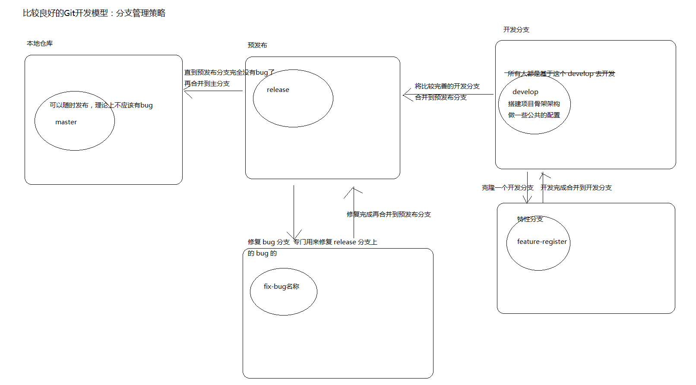

# Git 的灵魂：分支

## 概念

---

## 基本命令

- 查看分支：`git branch`

- 创建分支：`git branch <name>`
  + 基于某个分支创建分支
  + 先切换到基于的分支
  + 再创建分支

- 切换分支：`git checkout <name>`

- 交替切换分支：`git checkout -`

- 创建+切换分支：`git checkout -b <name>`

- 基于某个分支创建新的分支并切换到该分支：`git checkout -b <name> <name>`

- 合并某分支到当前分支：`git merge <name>`

- 合并某分支到当前分支并提交记录：`git merge --no-ff <name> -m "提交日志"`

- 删除分支：`git branch -d <name>`

- 以图表形式查看日志 `git log --graph`

## 分支管理策略

- master
  + 代码库应该有一个、且仅有一个主分支，所有提供给用户使用的正式版本，都在这个主分支上发布
  + Git主分支的名字，默认叫做 master
  + 主分支只用来分布重大版本
- develop
  + 日常开发应该在另一条分支上完成。我们把开发用的分支，叫做Develop
  + 如果想正式对外发布，就在Master分支上，对Develop分支进行"合并"（merge）
  + 合并的时候最好采用 `--no-ff` 的形式，在 master 上形成一个提交历史记录节点
- feature-特性名 特性（功能）分支
  + 针对某个具体的功能创建的一个分支
  + 开发的时候，所有开发人员针对 develop 进行开发，然后合并到 master
    * 然后我们可以基于 develop 分支创建一些特性分支（一般是开发人员自己创建的）
    * 团队开发人员都最好都基于 develop 分支去创建自己对应的特性分支，最后去和 develop 分支进行合并
- release 预发布分支
  + 发布之前先将 develop 分支预发布到 release 发布分支中
  + 接下来，测试人员就可以拿到这个 release 分支版本，进行测试
  + 测试人员如果在测试的过程中发现 bug，会将 bug 告诉响应的开发人员，bug 追踪系统
- fixbug 修改 bug 分支
  + 该分支用于解决测试人员提交给你的 bug 的
  + fixbug 分支解决完毕之后，最后再次合并到 release 预发布分支中
  + 再次交给测试人员，测试人员回去通过这个分支版本继续测试，找 bug
  + 直到最后没有问题，合并到 master 分支中

一般在开发过程中，会创建一个 develop 的开发分支，
永远不要基于 master 分支去开发。
master 分支最好用于保留一个没有 bug ，随时可以发送的一个版本。

- master 分支是 git 默认创建的分支，基本上所有分支都是以这个分支为中心进行的
- 不同分支中，可以同时进行完全不同的开发，各个分支之间不会相互影响彼此
- 等分支的开发完成后再与 master 分支进行合并
  + master 也叫作主干分支，是所有分支的原点，同时也是合并的终点
- 通过灵活运用分支，可以让多人同时高效的进行并行开发

关于分支的管理以及分支的协同开发，目前还体会不到，因为没有大型项目可以演练，后面可以在做项目的时候，
可以多给大家引入一些分支的使用以体会基于不同的分支开发所带来的好处，目前先以体会概念为主，
当然了，很多分支管理策略也只是理论上的畅想而已，真正在开发的过程中，都是可以灵活变通的，
并不一定完全遵守死板的规则。
